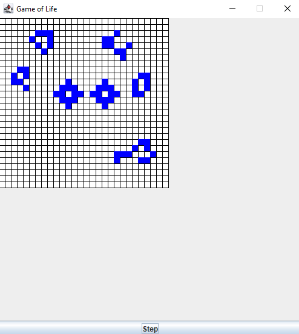

# Game of Life

This project implements the [Game of Life](https://en.wikipedia.org/wiki/Conway%27s_Game_of_Life) simulation in Java, with a graphical user interface for interacting with the simulation.

## Building and Running

To build and run the project, you will need to have the [Java Development Kit (JDK)](https://openjdk.java.net/) installed on your system.

To build the project, you need to run the main class in GameOfLifeGUI.

This will launch the GUI for the Game of Life simulation.

## Usage

The GUI allows the user to start and stop the simulation, and to adjust the speed of the simulation. The user can also click on individual cells in the game grid to toggle their state between alive and dead.

## Examples

Here is an example of the GUI in action:

## License

This project is released under the MIT License. See [LICENSE](LICENSE) for details.
